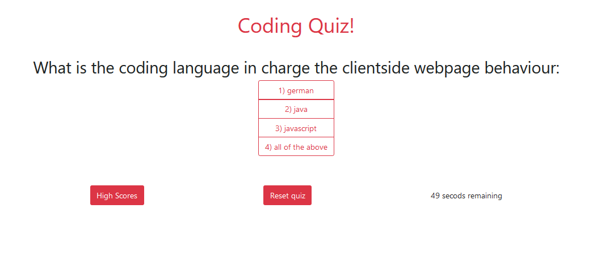

# Web-API Quiz

## Description

This application was built in order to help review basic coding knowledge, helping you know where to improve and study more.

## Usage

As soon as you load the page you are presented with 3 buttons, the first shows the high scores saved in the local storage, the second one resets the quiz, press it whenever you need to reset it, the last one just like it´s text says starts the quiz.

After clicking the Start Quiz button you are presented with a series of questions you have to answer, but be careful since avery wrong answer will reduce 10 seconds from the time you have to answer the quiz.

## Credits

Code was done by me!

## Link to webpage

https://enrique-v06.github.io/HEVM-Web-API-Quiz/